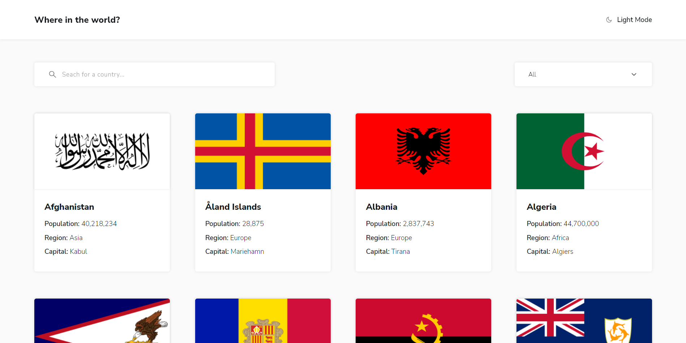

# Frontend Mentor - REST Countries API with color theme switcher solution

This is a solution to the [REST Countries API with color theme switcher challenge on Frontend Mentor](https://www.frontendmentor.io/challenges/rest-countries-api-with-color-theme-switcher-5cacc469fec04111f7b848ca). Frontend Mentor challenges help you improve your coding skills by building realistic projects. 

## Table of contents

- [Overview](#overview)
  - [The challenge](#the-challenge)
  - [Screenshot](#screenshot)
  - [Links](#links)
- [My process](#my-process)
  - [Built with](#built-with)
  - [What I learned](#what-i-learned)
  - [Useful resources](#useful-resources)
- [Author](#author)


## Overview

### The challenge

Users should be able to:

- See all countries from the API on the homepage
- Search for a country using an `input` field
- Filter countries by region
- Click on a country to see more detailed information on a separate page
- Click through to the border countries on the detail page
- Toggle the color scheme between light and dark mode *(optional)*

### Screenshot




### Links

- Solution URL: [Add solution URL here](https://your-solution-url.com)
- Live Site URL: [https://laurenxx-countries-switcher.netlify.app/](https://your-live-site-url.com)

## My process

### Built with

- Semantic HTML5 markup
- CSS Custom Properties
- Flexbox
- Mobile-first workflow
- React Router
- [React](https://reactjs.org/) - JS library
- [Styled Components](https://styled-components.com/) - For styles


### What I learned

```js
// Search by country name
 const countryName = document.querySelectorAll('.country-name');
  countryName.forEach(name => {
    if(name.innerHTML.toLowerCase().includes(input.toLowerCase())) {
      name.parentElement.parentElement.style.display = 'block';
    } else {
      name.parentElement.parentElement.style.display = 'none';
    }
  })

// Filter by Region
 const regions = [
    {
      name: 'All'
    },
    {
      name: 'Africa'
    },
    {
      name: 'Americas'
    },
    {
      name: 'Asia'
    },
    {
      name: 'Europe'
    },
    {
      name: 'Oceania'
    }
  ]
 async function filterByRegion(region) {
    
    if(region == 'All') {
      try {
        const res = await fetch(`https://restcountries.com/v2/all`)
        const data = await res.json()
        setCountries(data)
      }
      catch(err) {
        console.log(err)
      }
    } else {
      try {
        const res = await fetch(`https://restcountries.com/v2/region/${region}`)
        const data = await res.json()
        setCountries(data)
      }
      catch(err) {
        console.log(err)
      }
    }
  }

  const handleFilterByRegion = (e) => {
    e.preventDefault();
    filterByRegion();
  }
<form onSubmit={handleFilterByRegion}>
        <select 
          className='element' 
          name='filter-by-region' 
          id='filter-by-region'
          aria-label='Filter by Region'
          value={regions.name}
          onChange={e => filterByRegion(e.target.value)}
        >
        {regions.map((region, index) => (
          <option key={index} value={region.name}>
            {region.name}
          </option>
        ))}
        </select>
</form>
```


### Useful resources

- [REST Countries API](https://restcountries.com) - Database for countries.


## Author

- Website - [Wanxia Xie/Laurenxx](https://www.your-site.com)
- Frontend Mentor - [@awsmPuff](https://www.frontendmentor.io/profile/awsmPuff)
